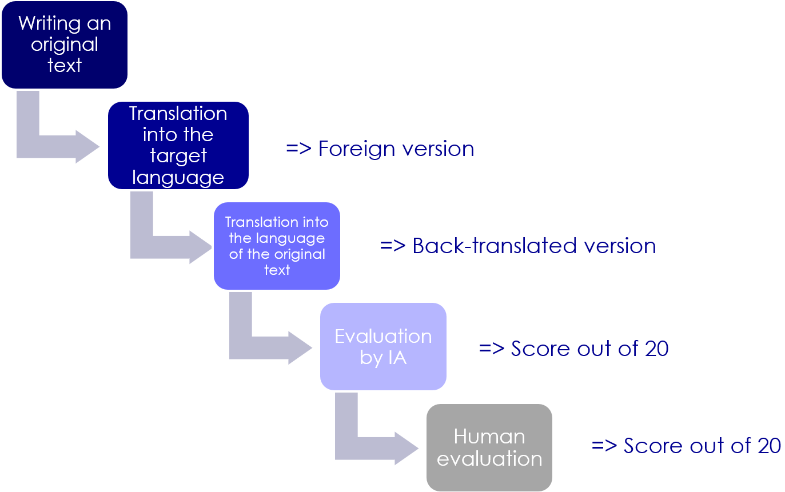

### Description

We evaluated **100+ Large Language Models (LLMs)** to address a fundamental challenge:  
the accurate assessment of AI linguistic capabilities on **low-resource languages**.  

In the context of international development, where linguistic diversity is immense, it is crucial that AI systems can communicate effectively and fairly with all populations.  
However, many languages still lack sufficient digital corpora for training, which often results in significant gaps in the models’ ability to reliably understand, translate, and generate text.  

The purpose of this work is to provide a **robust linguistic benchmarking methodology** designed to:  
- measure LLM performance on underrepresented languages,  
- identify current limitations,  
- foster the development of more inclusive and equitable AI solutions.

- **Language(s) (NLP):** Multiple low-resource languages, including Swahili, Kikuyu, Luhya, Luo, Kamba, Kisii, Meru, Maasai...(Kenya) and ....
- **License:** agpl-3.0

The following table gives you an overview of the benchmarks in EVALULLM.

| Name | Leaderboard name | # Tasks | Task Types   | Domains | Languages |
|------|------------------|---------|--------------|---------|-----------|
| [Kenya](https://www.ethnologue.com/country/KE/)       | Kenya       | 1 | Translation : 1 | general | 61 |
| [Senegal](https://www.ethnologue.com/country/SN/)     | Senegal     | 1 | Translation : 1 | general | 31 |
| [Nigeria](https://www.ethnologue.com/country/NG/)     | Nigeria     | 1 | Translation : 1 | general | 520 |
| [Gabon](https://www.ethnologue.com/country/GA/)       | Gabon       | 1 | Translation : 1 | general | 40 |
| [Maroc](https://www.ethnologue.com/country/MA/)       | Maroc       | 1 | Translation : 1 | general | 10 |
| [Haiti](https://www.ethnologue.com/country/HT/)       | Haiti       | 1 | Translation : 1 | general | 2 |
| [Madagascar](https://www.ethnologue.com/country/MG/)  | Madagascar  | 1 | Translation : 1 | general | 12 |
| [Türkiye](https://www.ethnologue.com/country/TR/)     | Türkiye     | 1 | Translation : 1 | general | 19 |
| [Ukraine](https://www.ethnologue.com/country/UA/)     | Ukraine     | 1 | Translation : 1 | general | 11 |
| [Jordan](https://www.ethnologue.com/country/JO/)      | Jordan      | 1 | Translation : 1 | general | 4 |
| [Bangladesh](https://www.ethnologue.com/country/BD/)  | Bangladesh  | 1 | Translation : 1 | general | 36 |
| [Kazakhstan](https://www.ethnologue.com/country/KZ/)  | Kazakhstan  | 1 | Translation : 1 | general | 4 |
| [Philippines](https://www.ethnologue.com/country/PH/) | Philippines | 1 | Translation : 1 | general | 175 |
| [Colombia](https://www.ethnologue.com/country/CO/)    | Colombia    | 1 | Translation : 1 | general | 83 |
| [Bolivia](https://www.ethnologue.com/country/BO/)     | Bolivia     | 1 | Translation : 1 | general | 39 |

### Workflow

If you want to generate evaluations via the score generation notebook, WARNING: To avoid biases, the original texts that you ask the LLM to translate into low-resource languages must be written by yourself. Do not use an AI, and do not copy from the Internet.

### Evaluation Rubric (Out of 20 Points)

This rubric evaluates translation quality based on **5 criteria**, each scored on a scale from 0 to 4.  
The final score is the sum of all criteria (maximum **20 points**).
In the leaderboard, the score is displayed as a **percentage**:  
**Final % = (Total Score ÷ 20) × 100**

#### Evaluation Criteria

| **Criterion**              | **Description**                                                                 | **Scoring Scale** |
|-----------------------------|---------------------------------------------------------------------------------|-------------------|
| **1. Lexical Accuracy**     | Are the words or word groups correctly translated and retranslated? Evaluates word-for-word and idiomatic accuracy. | 0 = frequent mistranslations 1 = several notable errors 2 = some acceptable deviations 3 = generally accurate 4 = highly accurate |
| **2. Syntactic Structure**  | Are word order, grammar, and punctuation consistent with the original?          | 0 = disorganized 1 = major errors 2 = acceptable but awkward 3 = mostly fluent with minor errors 4 = very well structured |
| **3. Global Meaning**       | Is the overall message preserved, even if some words differ?                    | 0 = incomprehensible 1 = many ambiguities 2 = general meaning kept but with losses 3 = well conveyed 4 = perfectly clear |
| **4. Tone and Register**    | Is the tone (formal/informal, empathetic, neutral, etc.) preserved?             | 0 = inconsistent 1 = major mismatches 2 = somewhat off but acceptable 3 = tone mostly respected 4 = natural and appropriate |
| **5. Natural Fluency**      | Does the translated text sound natural and "human"?                             | 0 = broken/robotic language 1 = difficult to follow 2 = readable but awkward 3 = relatively fluent 4 = very fluent and natural |

#### Final Score

- **Total** = Sum of the 5 scores (maximum 20 points)

##### Interpretation
- **17–20**: Excellent linguistic competence  
- **14–16**: Good competence, usable professionally  
- **10–13**: Average, some weaknesses but understandable  
- **6–9**: Weak, risky translation  
- **0–5**: Very poor, unusable in real contexts  

### Requirements
- Python 3.x
- pip
- (Optional) Virtual environment

### Install dependencies
pip install -r requirements.txt

### Usage
Run the application with:

python app.py

### Dataset Sources

- **Repository:** [https://huggingface.co/datasets/lojl/llms_low_resource_benchmark_2025](https://huggingface.co/datasets/lojl/llms_low_resource_benchmark_2025)  

### Bias, Risks, and Limitations

This dataset was generated by **evaluating LLMs with other LLMs**, which means that **no human evaluators were involved for all languages**.  
As a result, there may be limitations in the accuracy and reliability of the evaluations, especially for low-resource languages where the LLMs may have limited training data.  

Potential risks and limitations include:  
- **Evaluation bias:** The scores reflect the abilities of the evaluating LLMs, which may themselves have biases or gaps.  
- **Language coverage:** Some languages may be underrepresented, and results should not be considered fully comprehensive.  
- **Sociolinguistic nuances:** Cultural and contextual understanding might not be captured accurately by automated evaluation.  

Users should interpret the results with caution and consider supplementing with **human evaluation** where possible.

### Acknowledgment

We thank **[AFD - Agence Française de Développement](https://www.afd.fr/fr/accueil)** for their generous sponsorship.

If you'd like to sponsor us, please get in **[touch](mailto:jude.kaisens.data@gmail.com)**.